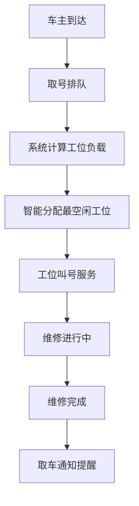
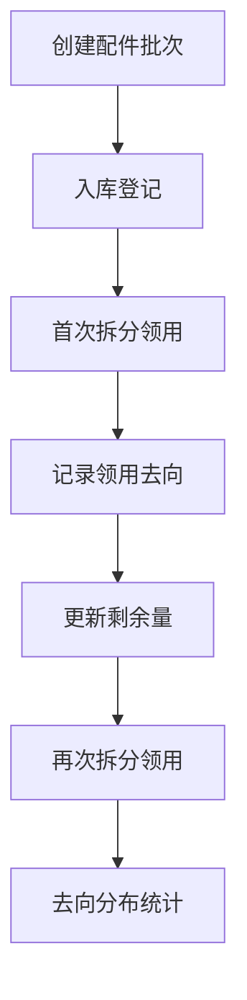

## 1. 产品概述

自行车维修保养管理系统是一款纯前端应用，为自行车店提供维修工位叫号、负载均衡调度以及配件批次拆分出库管理功能。系统帮助门店高效管理多个维修工位的并行叫号，通过智能负载均衡将车主引导到最空闲的工位，同时实现配件批次的拆分出库和剩余量追踪。

### 核心价值
- 提升维修工位利用率，减少车主等待时间
- 智能负载均衡，优化工位分配
- 精细化配件批次管理，追踪每一次拆分的去向
- 取车通知提醒，提升服务体验

## 2. 核心功能

### 2.1 用户角色
| 角色 | 注册方式 | 核心权限 |
|------|----------|----------|
| 门店管理员 | 内置账号 | 全部功能管理、数据统计 |
| 维修技师 | 工号登录 | 叫号操作、工位状态管理、配件领用 |
| 车主 | 现场取号 | 查看排队状态、接收取车通知 |

### 2.2 功能模块
1. **并行叫号模块**：取号排队、多窗口并行叫号、叫号状态显示
2. **负载均衡模块**：窗口负载计算、智能分配、跨窗口调剂
3. **配件批次模块**：批次入库管理、批次列表、剩余量追踪
4. **拆分出库模块**：批次拆分、多次领用记录、去向分布统计

### 2.3 页面详情
| 页面名称 | 模块名称 | 功能描述 |
|----------|----------|----------|
| 仪表盘 | 总览 | 今日叫号统计、工位状态概览、配件库存预警 |
| 叫号大厅 | 并行叫号 | 取号操作、叫号队列、多工位状态实时显示 |
| 工位调度 | 负载均衡 | 工位负载热力图、智能分配、跨窗口调剂 |
| 配件管理 | 配件批次 | 批次列表、入库管理、剩余量追踪 |
| 出库记录 | 拆分出库 | 批次拆分、领用记录、去向分布 |

## 3. 核心流程

### 3.1 叫号与负载均衡流程
车主到达门店 → 取号获取排队号 → 系统自动计算各工位负载 → 智能分配到最空闲工位 → 工位叫号服务 → 维修完成 → 取车通知

### 3.2 配件拆分出库流程
创建配件批次 → 入库登记 → 多次拆分领用 → 记录每次领用去向 → 实时计算剩余量 → 去向分布统计

## 4. 用户界面设计

### 4.1 设计风格
- **主色调**：深青色（#0F766E）搭配琥珀色（#D97706）强调
- **辅助色**：浅灰蓝背景、深灰文字
- **按钮风格**：圆角胶囊按钮，悬停有微动画效果
- **字体**：使用 "Noto Sans SC" 作为主要字体，清晰易读
- **布局风格**：卡片式布局，左侧导航栏 + 右侧内容区
- **图标风格**：线性图标，统一 2px 线条宽度

### 4.2 页面设计总览
| 页面名称 | 模块名称 | UI 元素 |
|----------|----------|----------|
| 仪表盘 | 总览 | 统计卡片、工位状态网格、库存预警列表、数据趋势图 |
| 叫号大厅 | 并行叫号 | 大号取号按钮、排队列表、工位状态卡片、叫号动画 |
| 工位调度 | 负载均衡 | 负载热力图、工位详情卡片、调剂操作面板、分配建议 |
| 配件管理 | 配件批次 | 批次列表、批次详情抽屉、剩余量进度条、入库表单 |
| 出库记录 | 拆分出库 | 拆分操作面板、领用记录时间线、去向分布图、剩余量追踪 |

### 4.3 响应式
- 桌面端优先设计，适配 1280px 及以上
- 平板端（768px-1279px）：导航栏折叠为图标模式
- 移动端（<768px）：底部导航栏，卡片单列布局
- 触摸优化：按钮最小尺寸 44px，列表项增加点击区域

### 4.4 动效设计
- 叫号时数字跳动动画
- 工位状态切换平滑过渡
- 负载均衡分配时有指示动画
- 配件拆分时有数量递减动画
- 页面切换淡入淡出效果
