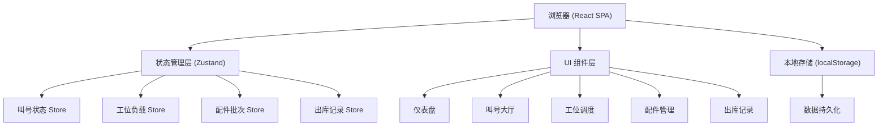
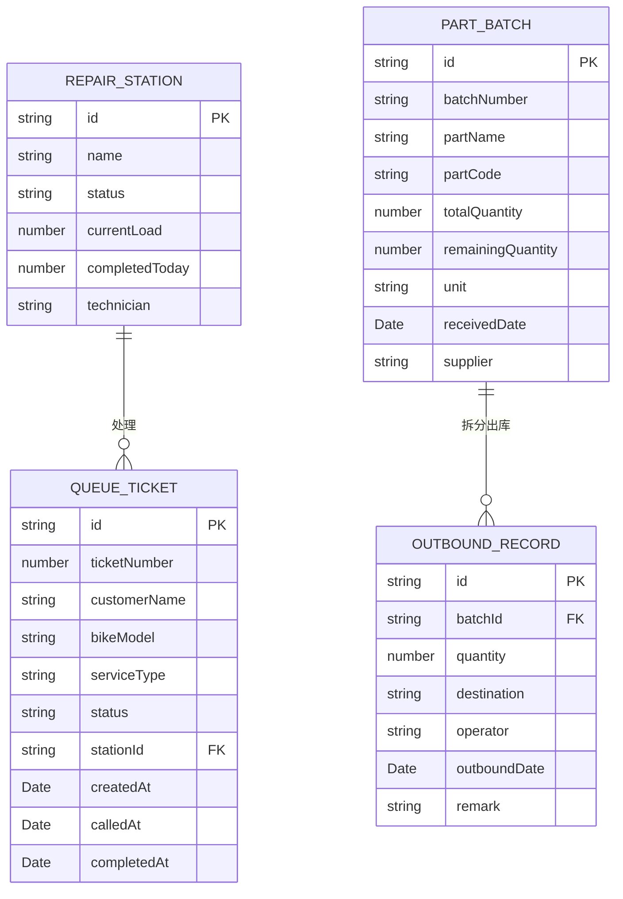

## 1. 架构设计



## 2. 技术描述

- **前端框架**：React@18 + TypeScript
- **构建工具**：Vite@5
- **样式方案**：TailwindCSS@3
- **状态管理**：Zustand
- **图标库**：Lucide React
- **数据持久化**：localStorage + Zustand persist
- **图表库**：Recharts
- **路由**：React Router DOM@6
- **动画**：Framer Motion

## 3. 路由定义

| 路由 | 页面名称 | 用途 |
|------|----------|------|
| / | 仪表盘 | 总览数据、工位状态、库存预警 |
| /queue | 叫号大厅 | 取号、叫号队列、工位状态 |
| /dispatch | 工位调度 | 负载均衡、工位管理、跨窗口调剂 |
| /parts | 配件管理 | 批次列表、入库、剩余量追踪 |
| /outbound | 出库记录 | 拆分出库、领用记录、去向分布 |

## 4. 数据模型

### 4.1 数据模型定义



### 4.2 类型定义

```typescript
// 叫号相关类型
type TicketStatus = 'waiting' | 'calling' | 'servicing' | 'completed' | 'cancelled';
type ServiceType = 'repair' | 'maintenance' | 'inspection' | 'custom';

interface QueueTicket {
  id: string;
  ticketNumber: number;
  customerName: string;
  phone: string;
  bikeModel: string;
  serviceType: ServiceType;
  description: string;
  status: TicketStatus;
  stationId: string | null;
  createdAt: Date;
  calledAt?: Date;
  completedAt?: Date;
}

// 工位相关类型
type StationStatus = 'idle' | 'busy' | 'offline';

interface RepairStation {
  id: string;
  name: string;
  status: StationStatus;
  currentLoad: number;
  completedToday: number;
  technician: string;
  avgServiceTime: number;
}

// 配件批次相关类型
interface PartBatch {
  id: string;
  batchNumber: string;
  partName: string;
  partCode: string;
  category: string;
  totalQuantity: number;
  remainingQuantity: number;
  unit: string;
  receivedDate: Date;
  supplier: string;
  pricePerUnit: number;
  location: string;
}

// 出库记录相关类型
interface OutboundRecord {
  id: string;
  batchId: string;
  quantity: number;
  destination: string;
  operator: string;
  outboundDate: Date;
  remark: string;
  ticketId?: string;
}

// 负载均衡算法相关
interface LoadBalanceResult {
  stationId: string;
  score: number;
  reason: string;
}
```

## 5. 核心算法

### 5.1 负载均衡算法
- 基于多因素加权评分：当前排队数、平均服务时长、今日完成量、工位状态
- 自动排除离线工位
- 支持手动调剂覆盖
- 跨窗口调剂时重新计算最优分配

### 5.2 批次拆分逻辑
- 校验剩余量充足性
- 记录每次拆分的去向
- 实时更新剩余量
- 支持拆分历史回溯和去向分布统计

## 6. 状态管理设计

### 6.1 Store 划分
- `useQueueStore`：叫号队列、取号、叫号操作
- `useStationStore`：工位管理、负载计算、负载均衡
- `usePartStore`：配件批次管理、入库、剩余量追踪
- `useOutboundStore`：出库记录、拆分操作、去向统计

### 6.2 持久化策略
- 使用 Zustand persist 中间件
- 所有核心数据存储到 localStorage
- 页面刷新后恢复状态
